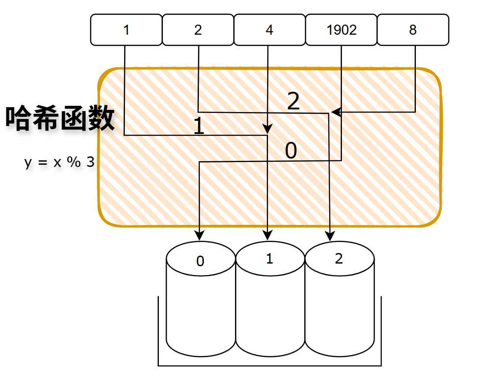

---

## 哈希表的定义

哈希表又称散列表，是一种支持快速插入查询、组织数据通过哈希函数进行的数据结构

---

## 哈希表的原理

哈希表通过哈希函数将键转化为桶地址，由此对桶进行操作

---

## 哈希表的相关概念

### a. 哈希函数

哈希函数不是某一个特定的高级函数，就是一个用于将键转换为桶的地址的函数

:::tip[e.g.]
比如 有数组`{1, 2, 4, 1902, 8}`

而我们的哈希函数就可以是`y = x % 3`

其中`y`也可以记作`hash(x)`,就是就是计算出的桶的地址

可以发现`1和4`、`2和8`经过哈希函数产生的桶地址相同，这是发生了**哈希冲突**

**哈希冲突**会降低哈希表的性能，我们需要尽量避免这种情况，先作了解
:::

#### 哈希函数性能

一个好的哈希表具有下面的特点

- 确定性：使得键和桶地址一一对应，也就是一个键的桶地址完全取决于它自己本身
- 简单性：哈希函数不能太复杂，避免降低哈希表的性能
- 均匀性：哈希函数越能让键值在桶中分布的随机和均匀，哈希函数的性能越好

对应哈希表，最理想的情况是键和桶完全一一对应

### b. 负载因子

负载因子是已利用的桶与总桶数的比值，一般情况下哈希表不会使用全部桶

- 我们需要尽量提高桶数组的空间利用率，负载因子不能太低
- 负载因子太高也容易产生哈希冲突，也要控制哈希因子不能太高

:::note[合理的负载因子]
比较合理的负载因子值为0.7
:::

### c. 哈希冲突

一般哈希函数会压缩键的范围，桶地址的范围一般会远远小于键的范围，不同的键映射到相同的桶的情况叫做哈希冲突，很难避免

#### 解决哈希冲突的一些方法

- 线性试探法
- 链地址法
- 再哈希法
- 公共溢出区法

---

## 哈希表特征

| 特征 | 描述 |
|------|------|
| 键值对结构 | 存储的基本单元是(key, value)对。 |
| 键的唯一性 | 键是唯一的，重复插入会覆盖旧值。 |
| 哈希函数访问 | 通过哈希函数计算键的存储位置，而非比较。 |
| 无序性 | 元素顺序不可预测。 |
| 冲突处理 | 必须有能力解决多个键映射到同一位置的冲突。 |
| 动态扩容 | 根据负载因子自动调整底层数组大小。 |
| 平均O(1)性能 | 在理想条件下，操作非常高效。 |

补充:

- 唯一性：一般说对相同的键再值插入会覆盖原有值，但是实际上键的重复插入方式不同会产生不同逻辑
- 哈希函数访问：通过比较计算键的储存位置的数据结构有单调序列、二叉搜索树，跳表等
- 无序性：哈希表内存中开劈的是连续空间，那为什么说哈希表有无序性？实际无序性指键值对的排列顺序在逻辑上是没有意义的、不可预测的,比如键为`1`,但是通过哈希函数映射至桶地址`1e5`,这种顺序跟键本身的值无关
- 动态扩容：一般是哈希表中的元素大于负载因子，就会触发了扩容，扩容的时间复杂度为$O(n)$,`n`为元素的数量,桶数组的大小通常翻倍并最近的的质数

## 哈希表相关问题

### 1. 要是键和桶地址一一对应，就是最理想的哈希表，这不就是数组吗？为什么还需要哈希表?

数组有其局限性:

1. 当键的取值范围极大，但是键的数量很少时，数组会产生巨大的空间浪费
2. 下标是整数，当键值类型变得复杂就无法使用

:::tip[e.g.]

1. 当键为float时，数组明显就无法使用了
2. 比如有一组数据`{1, 1e10, 1e10……}`(共有100个数据)，如果使用数组统计这一份数据中各数字的出现次数，那么大小至少需要1e10的空间，这显然是不合理的

:::

为了解决数组的局限性，我们使用哈希表:**哈希表用微小的性能损失和少量的空间浪费，换来了无与伦比的通用性和平均情况下O(1)时间复杂度的卓越性能**

### 2. 为什么桶数组的大小一般要是整数？

哈希函数在确定哈希表的桶索引时，最终几乎总是通过取模运算来完成的,这个取模值一般就是数组大小

$$index = hash(key) % M$$ (hash()指产生哈希值)
